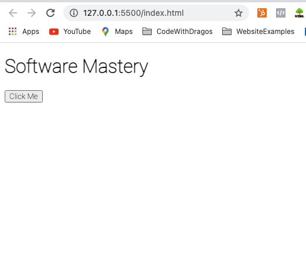
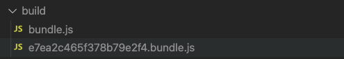
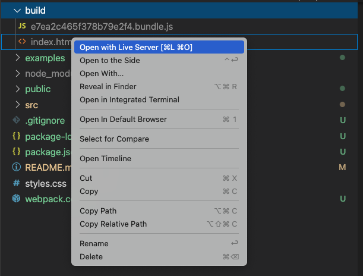
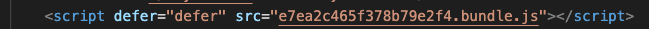

# Action Item: Build a Movie App with a Pagination component

Follow the steps to setup a single page app with React and Typescript where the users can:

1. Search for a movie
2. See the results, displayed in multiple pages
3. Change page using the pagination button
4. Check the individual movie details
5. Add a movie to favourites -- this will be persisted even if a user closes the page

Non-functional requirements:

1. Add unit(component) tests
2. Use `typescript` for code quality

# Started code

As starter code we will use the solution to the previous action item. 
Make sure you completed that one before starting the current one.

# Run the app

1. Install the dependencies:
    ```bash 
    npm install
    ```
2. Run the app:
    ```bash 
    npm start
    ```

**You should see this in your browser:**



## Step by Step Instructions

Follow the set of instructions bellow to setup a modern codebase for UI development and use React as frontend end library.


#### 1. Setting up `npm`
#### 2. Set up Webpack to bundle code
#### 3. Build for any browser with `Babel`
#### 4. Extending our tooling with Webpack plugins
#### 5. Adding React to leverage `JSX` and OOP with Components

------

## 1. Setting up `npm`

1. To use different packages we need to setup the package manager - `npm` in this folder:
    ```bash 
    npm init -y
    ```
2. Add a `.gitignore` file to leave the `node_modules` out of your commits:
    ```bash 
    echo "node_modules" > .gitignore 
    ```
    **Save the `.gitignore` file with the code editor to apply the changes.**

----

## 2. Set up Webpack to bundle  code

1. Install webpack as a development dependency by running:
    ```bash 
    npm install webpack --save-dev
    ```
2. Add an empty webpack configuration file:
    ```bash 
    echo "module.exports = {}" > webpack.config.js
    ```
----
3. Add an entry point to your `webpack.config.js` file:
    ```javascript 
    const path = require("path");

    module.exports = {
        entry: path.join(__dirname, "src/scripts.js"),
    }
    ```
----
4. Add an output configuration to the webpack file:
    ```javascript 
    const path = require("path");

    module.exports = {
        ...
        output: {
            path: path.resolve(__dirname, "build"),
            filename: "bundle.js",
        },
        mode: "production"
        ...
    }
    ```
    *Webpack will build a dependency tree based on our `exports/require` statements and compile into a single file.*
----
5. Add a script to build the application for production in the `package.json` file:
    ```javascript 
    module.exports = {
        ...
      "scripts": {
            ...,
            "build": "webpack"
        },
        ...
    }
    ```
----
6. Add `require/export` in you file so `webpack` can build you code:
    6.1 Add exports at the end of the `src/askQuestionSet.js` file:
    ```javascript

    ... 
    // This line at the bottom of the `src/askQuestionSet.js` file
    module.exports = askQuestionSet;
    ```
    6.2 Add an import to the top of `src/scripts.js` file:

    ```javascript
    // This line at the top of the `src/scripts.js` file
    const askQuestionSet = require("./askQuestionSet");

    ...
    ```
7. Run the `build` script and check the `/build` folder:
    ```bash 
    npm run build
    ```
----
8. Add the `/build` folder to the `.gitignore file`:
    ```bash 
    echo "build" >> .gitignore
    ```
    **Save the `.gitignore` file with the code editor to apply the changes.**
----
10. Replace the `script` references with a single one, generated by `webpack`:
```html
    <!-- Replace this -->
    <script src="./src/askQuestionSet.js"></script>
    <script src="./src/scripts.js"></script>

    <!-- With this -->
    <script src="./build/bundle.js"></script>
```

**Open the `index.html` file with live server and check it still works as expected.**

Congratulations! You are now using `Webpack` as a module bundler.

----

## 3. Build for any browser with `Babel`

*Given we now use webpack to bundle our code we can extend our workflow in many different ways. The most common one is to add `Babel` as a code transpiler so we can build for all the browsers but still use the latest `Javascript` features.*

Follow the instructions to add babel to your code base:

1. Install the `babel` loader for webpack by running:
    ```bash
    npm install -D babel-loader @babel/core @babel/preset-env webpack
    ```
---
2. Add the module configuration to your `webpack.config.js` file:
    ```javascript
    module: {
        rules: [
            {
            test: /\.m?js$/,
            exclude: /(node_modules|bower_components)/,
            use: {
                loader: 'babel-loader',
                options: { // our code will be compatible with Internet Explorer 11
                    presets: [["@babel/preset-env", { "targets": "IE 11" }]]
                }
            }
            }
        ]
    }

    ```
    **The loader will be used by `webpack` any time a `.js` file is found. Webpack will now use babel to translate the code following the configuration.**
---
3. You can now use advanced features like the `ES6` modules in your code. To test it out:

    3.1 Replace the `common.js` export with an `es6` one in `src/askQuestionSet.js`:
    ```javascript
    // Replace:
    module.exports = askQuestionSet;

    // With:
    export default askQuestionSet;
    ```
    3.1 Replace the `common.js` import with an `es6` one in `src/scripts.js`:
    ```javascript
    // Replace:
    const askQuestionSet = require("./askQuestionSet.js");

    // With:
    import askQuestionSet from "./askQuestionSet.js";
  
    ```
---
4. Run the `build` script again and check the app:
    ```bash 
    npm run build
    ```
    Everything should work just as before.

----

## 4. Extending our tooling with Webpack plugins

Webpack offers many plugins to extend our workflow, optimize our code and improve the development experience.

1. Avoid caching by producing a **unique bundle name** every time:
    Change the following in your `webpack.config.js` file:
    ```diff
    output: {
        path: path.resolve(__dirname, "build"),
    -    filename: "bundle.js",
    +    filename: "[contenthash].bundle.js",
    },

    ```
2. Run `build` and check your build folder:
    ```bash 
    npm run build
    ```
    The new bundle should have a unique name:
    

**How can we add the unique name automatically to the `index.html` file?**

3. Install the [HTMLWebpackPlugin](https://webpack.js.org/plugins/html-webpack-plugin/):
    ```bash 
    npm install --save-dev html-webpack-plugin
    ```
4. Add the following to your `webpack.config.js` file:
    ```diff
    + const HtmlWebpackPlugin = require('html-webpack-plugin');

    module.exports = {
        entry: path.join(__dirname, "src/scripts.js"),
        output: {
            path: path.resolve(__dirname, "build"),
            filename: "[contenthash].bundle.js",
        },
    +   plugins: [new HtmlWebpackPlugin({
    +       template: path.join(__dirname, "public", "index.html")
    +   })],
        mode: "production",
        module: {
            rules: [
                {
                test: /\.m?js$/,
                exclude: /(node_modules|bower_components)/,
                use: {
                    loader: 'babel-loader',
                    options: { // our code will be compatible with Internet Explorer 11
                        presets: [["@babel/preset-env", { "targets": "IE 11" }]]
                    }
                }
                }
            ]
        }
    }
    ```
5. Create a public folder:
    ```bash 
    mkdir public
    ```

6. Move the `index.html` file to the public folder:
    ```bash 
    mv index.html public/index.html
    ```

7. Remove the `<script>` tag from the `.html` file:
    ```diff
        <h1>Software Mastery</h1>
        <button id="btn-one">Click Me</button>
    -   <script src="./build/bundle.js"></script>
    ```
8. Remove the `build` folder:
    ```bash 
    rm -rf build
    ```
9. Run `build` and check your build folder:
    ```bash 
    npm run build
    ```
    *You should see something like this:*
    

**The plugin will add the generated bundles to the html file automatically:**
    

----


## 5. Adding React to leverage `JSX` and OOP with Components
1. Add `react-presets` for babel as a dependency
    ```bash 
    npm install --save-dev @babel/preset-react
    ```
2. Add react presets to the babel config in the webpack file:
    ```diff

        mode: "production",
        module: {
            rules: [
                {
    +               test: /\.m?js|jsx$/,
                    exclude: /(node_modules|bower_components)/,
                    use: {
                        loader: 'babel-loader',
                        options: { // our code will be compatible with Internet Explorer 11
    +                   presets: ["@babel/preset-react", ["@babel/preset-env", { "targets":   "IE 11" }]]
                        }
                    }
                }
            ]
        }
    
    ```
3. Delete our old `code`as we will use `React` instead:
    ```bash 
    rm src/askQuestionSet.js
    rm src/scripts.js
    ```
4. Add `react` and `react-dom` as a dependency:
    ```bash 
    npm install react-dom react
    ```

4. Add the new `React` code:
    ```bash 
    touch src/index.jsx
    ```
    In the `src/index.jsx` file add:
    ```javascript
    import ReactDOM from "react-dom";
    import React from "react";

    class App extends React.Component {
    render() {
        return (
            <div>
                <h3>Hello There! What is your name?</h3>
                <input></input>   
                <button onClick={() => alert("Hello")}>Say Hello</button>
            </div>
            );
        }
    }

    ReactDOM.render(
    <App/>,
    document.getElementById('root')
    );
    ```
5. Change the entry point in the `webpack.config.js` file:
    ```diff
    module.exports = {
    ...
    -    entry: path.join(__dirname, "src/scripts.js"),
    +    entry: path.join(__dirname, "src/index.jsx"),
    ...
    }
    ```

5. In the `public/index.html` file add:
    ```html
    <!DOCTYPE html>
    <html lang="en">
    <head>
        ...
    </head>
    <body> 
        <div id="root"></div>
    </body>
    </html>
    ```
5. Run the `build`, check the build folder and the browser:
    ```bash 
    npm run build
    ```

5. Add a development server to improve the experience:
    5.1 Extend the `webpack.config.js`:
    ```diff
    module.exports = {
    ...
    +    devServer: {
    +       port: 3000
    +},
    ...
    }
    ```
    5.2 Add a `dev` command to your `npm` scripts:
    ```diff 
    module.exports = {
        ...
    "scripts": {
            ...,
    +        "dev": "webpack serve"
        },
        ...
    }
    ```
5. Run the `dev` script and check the terminal and the browser:
    ```bash 
    npm run dev
    ```
    

#### Congratulations, you are now using `React` with your very own Babel and Webpack setup!

----

## Wrapping up

1. Make sure you push and commit your code
2. Set up a linter
3. Setup Git Hooks with Husky
4. Add `Typescript` using the [](ts-loader)
    4.1 Add the needed dependencies:
    ```bash
    npm install --save-dev typescript ts-loader
    ```
    4.2 Extend the webpack configuration:
    ```diff
    module: {
        rules: [
        {
            test: /\.m?js$/,
            exclude: /(node_modules|bower_components)/,
            use: {
                loader: 'babel-loader',
                options: { // our code will be compatible with Internet Explorer 11
                    presets: [["@babel/preset-env", { "targets": "IE 11" }]]
                }
            }  
        }
    +     {
    +        test: /\.tsx?$/,
    +         use: 'ts-loader',
    +        exclude: /node_modules/,
    +      },
        ],
    },
    ```
    4.3 Add a `tsconfig.json` file
    4.4 Change your files from `.jsx` to `.tsx` and you can now use static typing
5. Feel free to take the exercise further and experiment yourself with the setup


### Made with :orange_heart: in Berlin by @CodeWithDragos