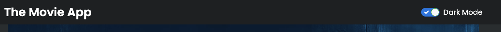

# Action Item: The Bare Bone Method

In this Action Item you will: 
- 🧱 Use the `Bare Bone Method` to 10X your development speed in the frontend
- 🏗️ Practice `state architecture` in the front-end by working with local and global state
- 🧪 Write `component` and `end-2end` tests to ensure quality

The following three challenges are based on **REAL interview tasks**:

## Challenges:
1. 💪[COMPETENT] Extend the `MainPage` to contain a view of the `Now Playing` movies
2. 🏋🏽‍♀️[PROFICIENT] Add a `Search` and a `Pagination` to the MainPage
3. 🔥[EXPERT] Add a `dark/light` switch to the whole app

#### What are we building?
- **🖥️ [VIDEO PREVIEW - What are we building?](https://www.loom.com/share/ccc78e8f7ce54dfcb198d5fd9531fa70)**
- **📌[Final Result LIVE](https://bare-bone-final.netlify.app/)**

We provide the starting code for this app so you can jump straight into the action. 

### Getting Started
1. 🔑 You will need an API Key to make the requests to the API. You can get one [here](https://developers.themoviedb.org/3/getting-started/introduction). Add the key to [`movieApiClient.ts`](src/utils/movieApiClient.ts)
2. Check the `package.json` to see the scripts available. 
   1. Run `npm start` to run the app
   2. Run `npm test` to run the unit tests
   3. Run `npm run cy:open` to run the `e2e` tests
3. [The starting point looks like this](https://bare-bone-starting-point.netlify.app/)

### Recommendations
1. Use the [React Dev Tools](https://chrome.google.com/webstore/detail/react-developer-tools/fmkadmapgofadopljbjfkapdkoienihi?hl=en) to inspect the component tree and data flow.
2. Draw your component breakdown using a tool like [Excalidraw](https://excalidraw.com/).
3. Use the **[State Architecture Cheat sheet](https://drive.google.com/file/d/1KtUkq7VfOjmAnH0jbrOScYQuI_7NZHCM/view?usp=sharing)** to decide where to place your state.

----

### 1. [COMPETENT] Extend the `MainPage` to contain a view of the `Upcoming` movies

#### Acceptance Criteria
1. The `MainPage` should display a section with the `Upcoming Movies` under the `TrendingNow` section
2. The style should be the same as the [TrendingNow](src/components/TrendingNow.tsx) component - you can just copy that one.

Use the `Bare Bone Method` to structure your component and data flow before styling. Check out how we do that here. [VIDEO WITH BARE BONE HERE]

##### 💡 Hint: you might need to extend the [movieApiClient] and add a method to fetch a list of the movies upcoming. Check out [the endpoint documentation here](https://developers.themoviedb.org/3/movies/get-upcoming).

##### 💡 Hint: you can reuse the same component if you "lift state", extract the business logic and isolate the __rendering__ into a stateless component.

#### Solution: Task 1.1

- **📝 [Step by Step Instructions](examples/solution_one/SOLUTION_ONE.md)**
- **🖥️ [VIDEO SOLUTION - Adding the Upcoming Movies](https://www.loom.com/share/670bb6de39b44d6d937f937949698b6f)**
- **🗂️ [CODE SOLUTION - Adding the Upcoming Movies](https://github.com/the-senior-dev/sm_bare_bone_method/tree/feature/solution-one)**

####  1.2 [PROFICIENT][BONUS] Refactor and apply `Separation of Concerns`

#### Solution: Task 1.2
- **🖥️ [VIDEO SOLUTION - Separation of concerns](https://www.loom.com/share/09fd272da95845d39d6736c12e14c025)**
- **🗂️ [CODE SOLUTION - Separation of concerns](https://github.com/the-senior-dev/sm_bare_bone_method/tree/feature/solution-one-extension)**

----

### 2. [COMPETENT] Add a `Search` and a `Pagination` to the MainPage

#### Acceptance Criteria
2.1. Add the missing parts and the functionality to the `SearchBar` component
- an input field where the users can type the `Movie` they want to search for
- a button that when pressed will cause a re-fetch of the movies that matched the search

2.2. Add a `Pagination` for the list of movies:
- the `pagination` should have a first, next, previous and last `button`
- clicking on the buttons should cause a refetch of the right movie page

##### 💡 Hint: take time to understand where the pagination state should live. You might need to "lift the state" in order to keep your components clean.

##### 💡 Hint: you might need to extend the [movieApiClient] to fetch a certain page of movie results. Check out [the endpoint documentation here](https://developers.themoviedb.org/3/search/search-movies).

#### Solution: Task 2 - Add Search & Pagination
- **📝 [Step by Step Instructions](examples/solution_two/SOLUTION_TWO.md)**
- **🖥️ [VIDEO SOLUTION - 2.1 Component Structure](https://www.loom.com/share/b156118a89c74e94882c44484c3d9d44)**
- **🖥️ [VIDEO SOLUTION - 2.2 State Architecture](https://www.loom.com/share/74583dc2efe844429ab8bfb6f76de956)**
- **🖥️ [VIDEO SOLUTION - 2.3 State Implementation](https://www.loom.com/share/0fca5c23551a4e0d8656c67272e6b9a5)**
- **🖥️ [VIDEO SOLUTION - 2.4 Adding Functionality](https://www.loom.com/share/aa6f38b850994db0bebc07e62be2f812)**
- **🖥️ [VIDEO SOLUTION - 2.5 App Overview](https://www.loom.com/share/9f5f83d3699b45719d2272881c384b8d)**
- **🗂️ [CODE SOLUTION - Adding Search](https://github.com/the-senior-dev/sm_bare_bone_method/tree/feature/solution-two)**
  
#### Bonus: Persisting state on page change using query params
- **🖥️ [VIDEO SOLUTION - 2.6 Use Query Params to keep state between page change](https://www.loom.com/share/31b700842d984a9b9ff4f578406b71cc)**

----

### 3. [EXPERT] Add a global dark mode switch to the application
#### Acceptance Criteria
1. In the `Header`, add a dropdown that will change the theme of the whole website
2. All the component should switch color to match the `dark/light` mode
3. The theme choice should be persisted in `localStorage` 
4. BONUS: use a `complex state machine` for the them state like `useReducer`, `immer.js` or `x-state`
> Light-on-dark color scheme —also called black mode, dark mode, dark theme, night mode, or lights-out (mode)— is a color scheme that uses light-colored text, icons, and graphical user interface elements on a dark background. -- Wikipedia

**[VIDEO - Dark Mode Feature Introduction](https://www.loom.com/share/121b83e6fda6404daa124d17f27984cb)**

##### 💡 Hint: take time to understand where the state of the state of the dark mode will live and how you will distribute it to all the components.

##### 💡 Hint: although we leave the choice up to you, we recommend a light-weight state management solution like `React.Context`.

#### Optional Acceptance Criteria:
- the `dark mode` switch should pickup the settings from local storage if it was configured previously
- use `x-state` instead of `useState` for the them state switch

#### Solution: Task 3 - Add a Dark Mode Switch
- **📝 [Step by Step Instructions](examples/solution_three/SOLUTION_THREE.md)**
- **🖥️ [VIDEO SOLUTION - 3.0 Choosing Colors](https://www.loom.com/share/308d69bb1acd41359cf308b263462d7f)**
- **🖥️ [VIDEO SOLUTION - 3.1 `React.Context` Overview](https://www.loom.com/share/3ef5f16063644582b39ae37b276f9690)**
- **🖥️ [VIDEO SOLUTION - 3.2 Creating a Context](https://www.loom.com/share/87fd5b58605d4f3c9a1a732c76e60cec)**
- **🖥️ [VIDEO SOLUTION - 3.3 Connect Context + Component Tree](https://www.loom.com/share/7f79aec6acd245a5b27707bc01b60e6a)**
- **🖥️ [VIDEO SOLUTION - 3.4 Final Result](https://www.loom.com/share/a1db587024144e0bb38426ce63eebe4b)**
- **🗂️ [CODE SOLUTION - Adding Dark Mode Switch](https://github.com/the-senior-dev/sm_bare_bone_method/tree/feature/solution-three)**

----

### Getting Help

If you have issues with the Action Item, you can ask for help in the [Community](https://community.theseniordev.com/) or in the [Weekly Q&A’s](https://calendar.google.com/calendar/u/0?cid=Y19kbGVoajU1Z2prNXZmYmdoYmxtdDRvN3JyNEBncm91cC5jYWxlbmRhci5nb29nbGUuY29t).

### Made with :orange_heart: in Berlin by @TheSeniorDev
