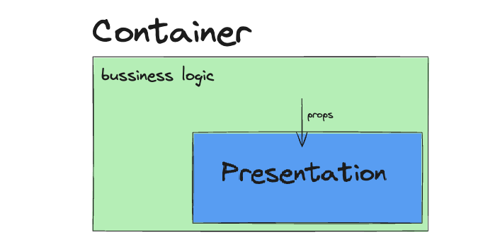

# Action Item: The Bare Bone Method

In this Action Item, you will:

- 🧱 Use the `Bare Bone Method` to `10X your development` speed in the frontend
- 🏗️ Practice `state architecture` in the front end by working with local and global state
- 🧪 Write `component` and `end-2end` tests to ensure quality


The following three challenges are based on **REAL interview tasks**:

## 🚀 Challenges

1. [ ] **🟢 EASY** - Extend the `MainPage` to contain a view of the `Now Playing` movies
2. [ ] **🟡 MEDIUM** - Add a `Search` and a `Pagination` to the MainPage
3. [ ] **🔴 HARD** - Add a `dark/light` switch to the whole app

## 🎁 Bonus Challenges

1. [ ] **🔴 HARD** Add `Redux` as a `state management` library using `redux-toolkit`
2. [ ] **🔴 HARD - Interview Question** - Add `Autocomplete` to the `SearchBar` component
3. [ ] **🔴 HARD - Interview Question** - Replace the `Pagination` with `Infinite Scrolling` using the `Intersection Observer`

#### What are we building?

- **🖥️ [VIDEO PREVIEW - What are we building?](https://www.loom.com/share/ccc78e8f7ce54dfcb198d5fd9531fa70)**
- **📌[Final Result LIVE](https://bare-bone-final.netlify.app/)**

We provide the starting code for this app so you can jump straight into the action.

### Getting Started

1. 🔑 You will need an API Key to make the requests to the API. You can get one [here](https://developers.themoviedb.org/3/getting-started/introduction).
2. Copy the `.env.example` file into a new `.env` file and add your API key there. Your `.env` file should look something like this:

```bash
API_KEY=affc0edf3f789f9357f1d525ba2cdn23
```

3. Check `package.json` to see the scripts available.

   1. Run `npm start` to run the app
   2. Run `npm test` to run the unit tests
   3. Run `npm run cy:open` to run the `e2e` tests

4. [The starting point looks like this](https://bare-bone-starting-point.netlify.app/)

### Recommendations

1. Use the [React Dev Tools](https://chrome.google.com/webstore/detail/react-developer-tools/fmkadmapgofadopljbjfkapdkoienihi?hl=en) to inspect the component tree and data flow.
2. Draw your component breakdown using a tool like [Excalidraw](https://excalidraw.com/).
3. Use the **[State Architecture Cheat sheet](https://drive.google.com/file/d/1KtUkq7VfOjmAnH0jbrOScYQuI_7NZHCM/view?usp=sharing)** to decide where to place your state.
4. Write `tests` to maintain a code coverage of more than **60%** at all times

---

### Step by Step Instructions

<details closed>
<summary>CLICK ME! - Walkthrough: 1. Extend the MainPage to contain a view of the "Upcoming: movies</summary>

### 1. 🟢 EASY - Extend the `MainPage` to contain a view of the `Upcoming` movies


#### Acceptance Criteria

1. The `MainPage` should display a section with the `Upcoming Movies` under the `TrendingNow` section
2. The style should be the same as the [TrendingNow](src/components/TrendingNow.tsx) component - you can just copy that one
3. Make sure you add the right `data-cy` selectors to make the `end-to-end` tests pass:

#### ✅ Check Your Progress 
You can check your progress by running the `end-to-end` tests for this feature like this:
```bash
npm run cy:task-one
```

You will need to add `cypress selectors` for the end-to-end tests to pass like this:


> :bulb: **Tip:** Write `unit tests` to maintain a `test code coverage` of more than **60%** at all times. You can check the test coverage by running the following in the terminal: **npm run test:coverage**.

:hammer_and_wrench: Use the `Bare Bone Method` :bone: to structure your component and data flow before styling. :art: [Check out how we do that here](https://community.theseniordev.com/c/software-mastery-2023/sections/33088/lessons/105114).

##### 💡 Hint: you might need to extend the [movieApiClient](src/utils/movieApiClient.ts) and add a method to fetch a list of the movies upcoming. Check out [the endpoint documentation here](https://developers.themoviedb.org/3/movies/get-upcoming).

##### 💡 Hint: you can reuse the same component if you "lift state", extract the business logic and isolate the **rendering** into a stateless component.

#### Solution: Task 1.1

- **📝 [Step-By-Step Instructions](examples/solution_one/SOLUTION_ONE.md)**
- **🖥️ [VIDEO SOLUTION - Adding the Upcoming Movies](https://www.loom.com/share/670bb6de39b44d6d937f937949698b6f)**
- **🗂️ [CODE SOLUTION - Adding the Upcoming Movies]** - `git checkout feature/solution-one`

#### 1.2 🎁 BONUS - Refactor and implement the `Container/Presentation Pattern` 🧠

By copying the existing `Trending` component we created a lot of duplicated code. In this bonus task, try to apply Separation of Concerns and implement the `Container/Presentation Pattern`:



Break the existing component into two:
- one responsible for fetching data, handling errors and the `loading` state
- another component responsible for displaying data

You can read more about the [container/presentation pattern here](https://www.patterns.dev/react/presentational-container-pattern/).

#### ✅ Check Your Progress 
Make sure the `end-to-end` tests still pass after the refactoring:
```bash
npm run cy:task-one-bonus
```


**__Note: You will have to update the unit tests as you change the component structure but you do not need to **change the **end-to-end** tests.**__**


#### Solution: Task 1.2

- **🖥️ [VIDEO SOLUTION - Separation of Concerns](https://www.loom.com/share/09fd272da95845d39d6736c12e14c025)**
- **🗂️ [CODE SOLUTION - Separation of Concerns]** - `git checkout feature/solution-one-extension`

</details>

---

<details closed>
<summary>CLICK ME! - Walkthrough: 2. Add a "Search" and a "Pagination" to the MainPage</summary>

### 2. 🟡 MEDIUM - Add a `Search` and a `Pagination` Component to the MainPage

#### Acceptance Criteria

2.1. Add the missing parts and the functionality to the `SearchBar` component

- an `input` field where the users can type the `Movie` they want to search for
- a `button` that when pressed will cause a re-fetch of the movies that matched the search


> :bulb: **Tip:** Write `tests` to maintain a code coverage of more than **60%** at all times. You can check the test coverage by running the following in the terminal: **npm run test:coverage**.


#### ✅ Check Your Progress
Make sure the `end-to-end` tests for the search feature pass:
```bash
npm run cy:task-two-search
```

2.2. Add a `Pagination` for the list of movies:

- the `pagination` should have a first, next, previous, and last `button`
- clicking on the buttons should cause a re-fetch of the right movie page


#### ✅ Check Your Progress 
Make sure the `end-to-end` tests for the pagination feature pass:
```bash
npm run cy:task-two-pagination
```

##### 💡 Hint: take time to understand where the pagination state should live. You might need to "lift the state" to keep your components clean.

##### 💡 Hint: you will need to extend the [movieApiClient](src/utils/movieApiClient.ts) to fetch a certain page of movie results. Check out [the endpoint documentation here](https://developers.themoviedb.org/3/search/search-movies).

##### 💡 Hint: Write `tests` to maintain a code coverage of more than **60%** at all times. You can check the test coverage by running the following in the terminal: **npm **run test:\*\* **coverage**.

#### Solution: Task 2 - Add Search & Pagination

- **📝 [Step by Step Instructions](examples/solution_two/SOLUTION_TWO.md)**
- **🖥️ [VIDEO SOLUTION - 2.1 Component Structure](https://www.loom.com/share/b156118a89c74e94882c44484c3d9d44)**
- **🖥️ [VIDEO SOLUTION - 2.2 State Architecture](https://www.loom.com/share/74583dc2efe844429ab8bfb6f76de956)**
- **🖥️ [VIDEO SOLUTION - 2.3 State Implementation](https://www.loom.com/share/0fca5c23551a4e0d8656c67272e6b9a5)**
- **🖥️ [VIDEO SOLUTION - 2.4 Adding Functionality](https://www.loom.com/share/aa6f38b850994db0bebc07e62be2f812)**
- **🖥️ [VIDEO SOLUTION - 2.5 App Overview](https://www.loom.com/share/9f5f83d3699b45719d2272881c384b8d)**
- **🗂️ CODE SOLUTION** - `git checkout feature/solution-two`

####  🎁 Bonus: 2.6 Persisting state on page change using query params

- **🖥️ [VIDEO SOLUTION - 2.6 Use Query Params to keep state between page change](https://www.loom.com/share/31b700842d984a9b9ff4f578406b71cc)**

####  🎁 Bonus: 2.7 Trigger Search on Enter
#### Acceptance Criteria
- Enable users to initiate a search by pressing the Enter key in the search input field.

1. Modify the `SearchBar` Component:

In your SearchBar component, add an `onKeyPress` event handler to the search input. Check if the pressed key is the Enter key.
If it is, trigger the search function.

```jsx
// in the component
const handleKeyPress = (event) => {
  if (event.key === 'Enter') {
    setSearchText(inputText);
  }
};

// In the render method
<SearchInput
  onKeyPress={handleKeyPress}
  // other props
/>
```

</details>

---

<details closed>
<summary>CLICK ME! - Walkthrough: 3. Add a theme switch to the application</summary>

### 3. 🔴 HARD -  Add a global theme switch to the application

#### Acceptance Criteria

1. In the `Header`, add a dropdown that will change the theme of the whole website
2. All the components should switch color to match the `dark/light` mode
3. The theme choice should be persisted in `localStorage`
4. BONUS: use a `complex state machine` for the theme state like `useReducer`, `immer.js` or `x-state`
   > Light-on-dark color scheme —also called black mode, dark mode, dark theme, night mode, or lights-out (mode)— is a color scheme that uses light-colored text, icons, and graphical user interface elements on a dark background. -- Wikipedia

**[VIDEO - Dark Mode Feature Introduction](https://www.loom.com/share/121b83e6fda6404daa124d17f27984cb)**


#### ✅ Check Your Progress 
Make sure the `end-to-end` tests for the pagination feature pass:
```bash
npm run cy:task-three-theme
```

##### 💡 Hint: take time to understand where the state of the dark mode will live and how you will distribute it to all the components.

##### 💡 Hint: although we leave the choice up to you, we recommend a lightweight state management solution like `React.Context`.

#### Optional Acceptance Criteria:

- the `dark mode` switch should pick up the settings from local storage if it was configured previously
- use `x-state` instead of `useState` for the theme switch

#### Solution: Task 3 - Add a Dark Mode Switch

- **📝 [Step by Step Instructions](examples/solution_three/SOLUTION_THREE.md)**
- **🖥️ [VIDEO SOLUTION - 3.0 Choosing Colors](https://www.loom.com/share/308d69bb1acd41359cf308b263462d7f)**
- **🖥️ [VIDEO SOLUTION - 3.1 `React.Context` Overview](https://www.loom.com/share/3ef5f16063644582b39ae37b276f9690)**
- **🖥️ [VIDEO SOLUTION - 3.2 Creating a Context](https://www.loom.com/share/87fd5b58605d4f3c9a1a732c76e60cec)**
- **🖥️ [VIDEO SOLUTION - 3.3 Connect Context + Component Tree](https://www.loom.com/share/7f79aec6acd245a5b27707bc01b60e6a)**
- **🖥️ [VIDEO SOLUTION - 3.4 Final Result](https://www.loom.com/share/a1db587024144e0bb38426ce63eebe4b)**
- **🗂️ [CODE SOLUTION - Adding Dark Mode Switch](https://github.com/the-senior-dev/sm_bare_bone_method/tree/feature/solution-three)**

</details>

---

### Step-by-Step Instructions For Bonus Challenges 🎁

<details closed>
<summary>CLICK ME! - Walkthrough: 4. Add Redux as a state management library</summary>

### 1. 🔴 HARD - Add `Redux` as a state management library

#### Acceptance Criteria

Follow the steps [here](https://redux-toolkit.js.org/tutorials/quick-start) to set up `redux toolkit` for our application.

1. Create a new `store` for the theme
2. Connect the theme toggle to `Redux` instead of `React.Context`

### Step by Step

1. Install `redux-toolkit`:

```bash
npm install @reduxjs/toolkit react-redux
```

2. Add a `Store` in [src/store/redux/store.ts]:

```typescript
import { configureStore } from "@reduxjs/toolkit";
import themeReducer from "./themeSlice";

export const store = configureStore({
  reducer: { themeReducer },
  devTools: process.env.NODE_ENV !== "production", // enable Redux DevTools
});

// Infer the `RootState` and `AppDispatch` types from the store itself
export type RootState = ReturnType<typeof store.getState>;
// Inferred type: {posts: PostsState, comments: CommentsState, users: UsersState}
export type AppDispatch = typeof store.dispatch;
```

3. Add a `ThemeSlice` in [src/store/redux/themeReducer.ts]:

```typescript
import { createSlice } from "@reduxjs/toolkit";
import { Theme, ThemeName, themeList } from "../theme";

export interface ThemeState {
  theme: Theme;
}

const initialState: ThemeState = {
  theme: themeList.light,
};

export const themeSlice = createSlice({
  name: "theme",
  initialState,
  reducers: {
    toggleTheme: (state: ThemeState) => {
      // pure function
      if (state.theme.name === ThemeName.LIGHT) {
        state.theme = themeList.dark;
      } else {
        state.theme = themeList.light;
      }
    },
  },
});

// Action creators are generated for each case reducer function
export const { toggleTheme } = themeSlice.actions;

export default themeSlice.reducer;
```

And add the Redux `Provider` to your app so you can use it in your `Components`:

```diff
import MoviePage from "./views/MoviePage";
import Footer from "./components/Footer";
import Header from "./components/Header";
import { DarkModeContext, Theme, themeList, ThemeName } from "./store/context";
import { DarkModeContext } from "./store/context";
import AppContainer from "./components/styled/AppContainer";
import { Theme, themeList, ThemeName } from "./store/theme";

// redux
+ import { store } from "./store/reduxStore/store";
+ import { Provider } from "react-redux";

export default function App() {
  const [activeTheme, setActiveTheme] = useState(themeList.light);

+   return (<Provider store={store}>
        <AppContainer>
          <Header></Header>
          <Router>
            <Routes>
              <Route path="/" element={<MainPage />} />
              <Route path="/movie/:id" element={<MoviePage />}></Route>
            </Routes>
          </Router>
          <Footer></Footer>
        </AppContainer>
+      </Provider>
    </DarkModeContext.Provider>
  );
}
```

And use both `Actions` and the `Store` in your components. In [src/components/DarkModeToggle.tsx](src/components/DarkModeToggle.tsx):

```diff
import React, { useContext } from "react";
import Toggle from "react-toggle";
import styled from "styled-components";
_import { DarkModeContext, themeList, ThemeName } from "../store/context";
+import { useDispatch, useSelector } from "react-redux";
+import { themeList } from "../store/theme";
+import { ThemeState, toggleTheme } from "../store/redux/themeSlice";

export default function DarkModeToggle() {
- const { theme, toggleTheme } = useContext(DarkModeContext);
+  const theme = useSelector((state: ThemeState) => state.theme);
+  const dispatch = useDispatch();

  return (
    <ToggleContainer>
      <Toggle
-       defaultChecked={context.theme === themeList.dark}
+       defaultChecked={theme === themeList.dark}
        onChange={() => {
+          dispatch(toggleTheme());
        }}
      />
      ...
      <ToggleLabel>Dark Mode</ToggleLabel>
    </ToggleContainer>
  );
```

#### ✅ Check Your Progress 
Make sure the `end-to-end` tests for the theme feature pass after the switch:
```bash
npm run cy:task-three-theme
```

</details>

---

### Getting Help

If you have issues with the Action Item, you can ask for help in the [Community](https://community.theseniordev.com/) or in the [Weekly Coaching Calls](https://community.theseniordev.com/c/coaching-calls/?sort=asc).

### Made with :orange_heart: in Berlin by @theSeniorDev
