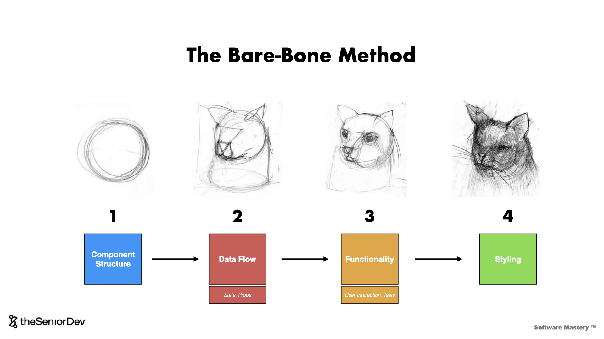
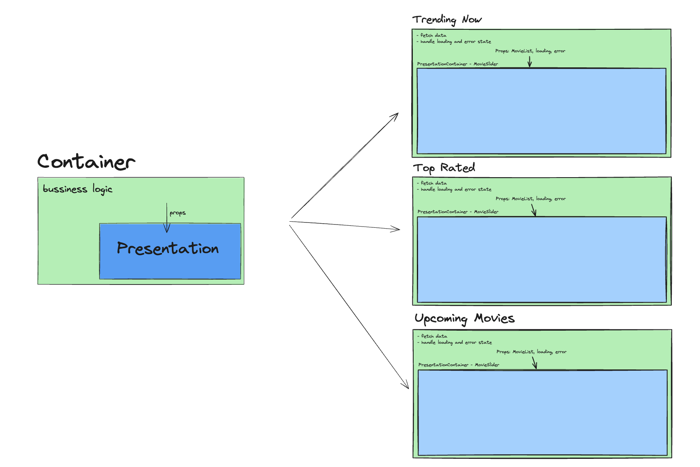
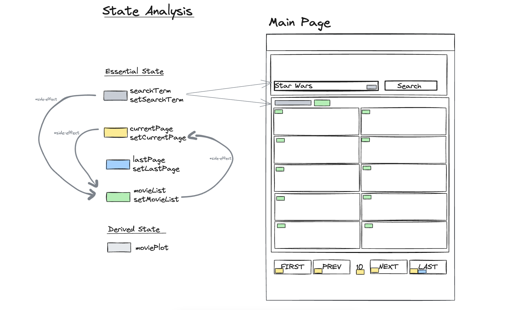

# Action Item: The Bare Bone Method

In this Action Item, you will:

- 🧱 Use the `Bare Bone Method` to `10X your development` speed in the frontend
- 🏗️ Practice `state architecture` in the front end by working with local and global state
- 🧪 Write `component` and `end-2end` tests to ensure quality


The following three challenges are based on **REAL Senior Frontend Interviews**.

## 🚀 Challenges

1. [ ] **🟢 EASY** - Extend the `MainPage` to contain a view of the `Now Playing` movies
2. [ ] **🟡 MEDIUM** - Add a `Search` and a `Pagination` to the MainPage
3. [ ] **🔴 HARD** - Add a `dark/light` switch to the whole app

## 🎁 Bonus Challenges

1. [ ] **🔴 HARD** Add `Redux` as a `state management` library using `redux-toolkit`
2. [ ] **🔴 HARD** Add `Autocomplete` to the `SearchBar`
3. [ ] **🔴 HARD** Use `lodash` to `debounce` the `Autocomplete` API Call

#### What are we building?

- **🖥️ [VIDEO PREVIEW - What are we building?](https://www.loom.com/share/ccc78e8f7ce54dfcb198d5fd9531fa70)**
- **📌 [Final Result LIVE](https://bare-bone-final.netlify.app/)**
- **🎨 [The original MovieDB as inspiration for our UI](https://www.themoviedb.org/)**

> We provide the starting code for this app so you can jump straight into the action. Make sure you spend a couple of minutes to get familiar with the codebase, the `webpack` configurations and the tests setup.

We advise you use the Bare Bone Method at all times:


### Getting Started 🚀

1. You will need an `API Key`🔑  to make the requests to the `MoviesAPI`. You can get one [here](https://developers.themoviedb.org/3/getting-started/introduction).
2. Copy the `.env.example` file into a new `.env` file and add your `API Key` there. Your `.env` file should look something like this:

```bash
API_KEY=affc0edf3f789f9357f1d525ba2cdn23
```

3. Check `package.json` to see the scripts available.

- 🚀 Run `npm run dev` to run the app.
- ✅ Run `npm test` to run the `unit tests`.
- 🌐 Run `npm run cy:run` to run the `end-to-end` tests.
- 🔌 Run `npm run server:kill` to kill the server if it is still running after the `e2e` tests

4. [Click here to see the starting point.](https://bare-bone-starting-point.netlify.app/)

### Recommendations 📝

1. 🔍 Use the [React Dev Tools](https://chrome.google.com/webstore/detail/react-developer-tools/fmkadmapgofadopljbjfkapdkoienihi?hl=en) to inspect the component tree and data flow.
2. 🎨 Draw your `component` breakdown using a tool like [Excalidraw](https://excalidraw.com/).
3. 📚 Use the **[State Architecture Cheatsheet](https://drive.google.com/file/d/1KtUkq7VfOjmAnH0jbrOScYQuI_7NZHCM/view?usp=sharing)** to decide where to place your state.
4. ✍️ Write `tests` to maintain a code coverage of more than **60%** at all times.

---

### Step by Step Instructions

<details closed>
<summary>CLICK ME! - Walkthrough: 1. Extend the MainPage to contain a view of the "Upcoming Movies"</summary>

### 1. 🟢 EASY - Extend the `MainPage` to contain a view of the `Upcoming` movies


### 📋 Acceptance Criteria 

1. The `MainPage` should display a section with the `Upcoming Movies` under the `Top Rated` section
2. The style should be the same as the [TrendingNow](src/components/TrendingNow.tsx) or [TopRated](TopRatedMovies.tsx) component - you can just copy one of them
3. Make sure you add the right `data-testid` selectors to make the `end-to-end` tests pass:


#### ✅ Check Your Progress 
You can check your progress by running the `end-to-end` tests for this feature like this:
```bash
npm run cy:task-one
```

##### 💡 **HINT:** Write `unit tests` to maintain a `test code coverage` of more than **60%** at all times. You can check the test coverage by running the following in the terminal: **npm run test:coverage**.

##### 💡 Hint: Use the `Bare Bone Method` :bone: to structure your component and data flow before styling. :art: [Check out how we do that here](https://community.theseniordev.com/c/software-mastery-2023/sections/33088/lessons/105114).

##### 💡 Hint: you might need to extend the [MovieApiClient](src/utils/MovieApiClient.ts) and add a method to fetch a list of the movies upcoming. Check out [the endpoint documentation here](https://developers.themoviedb.org/3/movies/get-upcoming).

### Step-By-Step Instructions - Task 1

#### 1. Copy the `TrendingNow.ts`

1. Change the file name to `UpcomingMovies.ts`
2. Add it to the bottom of [MainPage.tsx](src/views/MainPage.tsx)
3. Update the heading text to "Upcoming Movies" instead of "Trending Now"
5. Updated the content of the component including `data-testid` attributes and `aria-label` to "upcoming" instead of "trending"

#### 2. Add an API call for `upcoming` movies

1. Add a new method to the API client that can fetch the upcoming movies in [MovieApiClient.ts](src/utils/MovieApiClient.ts)
2. Copy and refactor the `getMovieListNowPlaying` method - check the [API Docs](https://developers.themoviedb.org/3/movies/get-upcoming)
3. Clean your code, write unit tests for your component and you are done

#### 3. Apply the `Bare Bone Method` to the component

Although you do not need to apply the `Bare Bone Method` in this first task, this is how it would look like:


And the in-depth state analysis:


Our final `Upcoming` component looks like this:
```jsx
import React, { useEffect, useState } from "react";
import styled from "styled-components";

import SimpleMovieCard from "./SimpleMovieCard";
import movieApiClient from "../utils/apiClient";
import { ErrorMessage, PageSection, SectionTitle } from "./styled";
import LoadingIndicator from "./styled/LoadingIndicator";

export default function UpcomingMovies() {
  const [movieListUpcoming, setMovieListUpcoming] = useState<Movie[] | null>(
    []
  );
  const [error, setFetchError] = useState<ApiError | null>(null);
  const [loading, setLoading] = useState<boolean>(true);

  useEffect(() => {
    const fetchMovies = async () => {
      try {
        setLoading(true);
        const data = await movieApiClient.getMovieListUpcoming();
        if ("message" in data) {
          setFetchError({ message: data.message, isError: true });
        } else {
          setMovieListUpcoming(data.results);
        }
      } catch (err) {
        setFetchError({ message: "An error occured.", isError: true });
      } finally {
        setLoading(false);
      }
    };

    fetchMovies();
  }, []);

  if (loading) {
    return (
      <PageSection aria-labelledby="upcoming-movies-now-heading">
        <SectionTitle>Upcoming Movies</SectionTitle>
        <UpcomingContainer>
          <LoadingIndicator data-testid="upcoming-movies-loading" />
        </UpcomingContainer>
      </PageSection>
    );
  }

  if (error) {
    return (
      <PageSection aria-labelledby="upcoming-movies-now-heading">
        <SectionTitle>Upcoming Movies</SectionTitle>
        <UpcomingContainer>
          <ErrorMessage
            data-testid="upcoming-movies-error-message"
            aria-live="polite"
          >
            {error.message}
          </ErrorMessage>
        </UpcomingContainer>
      </PageSection>
    );
  }

  return (
    <PageSection aria-labelledby="upcoming-movies-now-heading">
      <SectionTitle>Upcoming Movies</SectionTitle>
      <UpcomingContainer
        data-testid={"upcoming-movies-container"}
        aria-label="List of upcoming movies"
        role="list"
      >
        {movieListUpcoming?.map((mov) => (
          <SimpleMovieCard
            data-testid={`upcoming-movies-card-${mov.id}`}
            movie={mov}
            key={mov.id}
          />
        ))}
      </UpcomingContainer>
    </PageSection>
  );
}
```

#### 3. Write `unit tests` for your component to keep the `test code coverage` high.

You can check the tests in [src/components/TrendingNow.spec.tsx](src/components/TrendingNow.spec.tsx) as a starting point.

---

#### 🤖 A.I. Tooling Mastery 🤖

Use [ChatGPT](https://chat.openai.com/) to write unit tests, but make sure you proofread the result. Here is a recommended `GPT prompt`:

> Write unit tests for the following component using the AAA pattern, the Given > When > Then for test messages and aim for 100% test coverage: {Component Code HERE}

Use jest and the react-testing-library for the tests.

---

Once you are done, run the `unit` tests:
```bash
npm test
```

And the `end-to-end` tests:
```bash
npm run cy:task-one
```


⚠️ Make sure all the tests pass, commit, and push your code to the main branch.⚠️

#### Task 1 - Solution & Explanation:
- **🖥️ [VIDEO SOLUTION - Adding the Upcoming Movies](https://www.loom.com/share/0208c5f4a3934f48a401de821f4ec31e?sid=2c73f3c0-918d-4bbe-afd2-5cb352eb0dad)**
- **🗂️ [CODE SOLUTION - Adding the Upcoming Movies]** - `git checkout feature/solution-one`

#### 1.2 🎁 BONUS - Refactor and implement the `Container/Presentation Pattern` 🧠

By copying the existing `Trending` component we created a lot of duplicated code. In this bonus task, we will implement the `Container/Presentation Pattern` to reduce the amount of duplicated code:

**🧠 Container/Presentation Pattern:**


**🧠 Container/Presentation Implementation:**


Break the existing component into two:
- one responsible for fetching data, handling errors and the `loading` state
- another component responsible for displaying data

You can read more about the [container/presentation pattern here](https://www.patterns.dev/react/presentational-container-pattern/).

#### ✅ Check Your Progress 
Make sure the `end-to-end` tests still pass after the refactoring:
```bash
npm run cy:task-one-bonus
```


**💡 Tip: You will have to update the `unit tests` as you change the component structure but you do not need to change the `end-to-end tests`.**

**💡 Tip: You can reuse code further with a `custom hook` for `data fetching`.**

#### Solution: Task 1.2

Our `Presenter Component` looks like this:
```jsx
import React from "react";

import SimpleMovieCard from "./SimpleMovieCard";
import LoadingIndicator from "./styled/LoadingIndicator";

import {
  ErrorMessage,
  MovieSliderContainer,
  PageSection,
  SectionTitle,
} from "./styled";

interface MovieSliderProps {
  movieList?: Movie[];
  error?: ApiError | null;
  headingText: string;
  listType?: "upcoming" | "trending" | "top-rated";
  loading?: boolean;
}

export default function MovieSlider({
  movieList,
  error,
  headingText,
  listType,
  loading,
}: MovieSliderProps) {
  if (loading) {
    return (
      <PageSection aria-labelledby={`${listType}-movies-heading`}>
        <SectionTitle>{headingText}</SectionTitle>
        <MovieSliderContainer>
          <LoadingIndicator data-testid={`${listType}-movies-loading`} />
        </MovieSliderContainer>
      </PageSection>
    );
  }

  if (error) {
    return (
      <PageSection aria-labelledby={`${listType}-movies-now-heading`}>
        <SectionTitle>{headingText}</SectionTitle>
        <MovieSliderContainer>
          <ErrorMessage
            data-testid={`${listType}-movies-error-message`}
            aria-live="polite"
          >
            {error.message}
          </ErrorMessage>
        </MovieSliderContainer>
      </PageSection>
    );
  }

  return (
    <PageSection aria-labelledby={`${listType}-movies-heading}`}>
      <SectionTitle>{headingText}</SectionTitle>
      <MovieSliderContainer
        data-testid={`${listType}-movies-container`}
        aria-label={`List of ${movieList} movies`}
        role="list"
      >
        {movieList?.map((movie) => (
          <SimpleMovieCard
            movie={movie}
            key={movie.id}
            data-testid={`${listType}-movies-card-${movie.id}`}
          />
        ))}
      </MovieSliderContainer>
    </PageSection>
  );
}
```

And one of our `Container Component` looks like this:
```jsx
import React, { useEffect, useState } from "react";

import movieApiClient from "../utils/apiClient";
import MovieSlider from "./MovieSlider";

export default function TrendingNow() {
  const [movieListTrending, setMovieListTrending] = useState<Movie[]>(
    []
  );
  const [error, setFetchError] = useState<ApiError | null>(null);
  const [loading, setLoading] = useState<boolean>(true);

  useEffect(() => {
    const fetchMovies = async () => {
      try {
        setLoading(true);
        const data = await movieApiClient.getMovieListNowPlaying();
        if ("message" in data) {
          setFetchError({ message: data.message, isError: true });
        } else {
          setMovieListTrending(data.results);
        }
      } catch (err) {
        setFetchError({ message: "An error occured.", isError: true });
      } finally {
        setLoading(false);
      }
    };

    fetchMovies();
  }, []);

  return (
    <MovieSlider
      movieList={movieListTrending}
      headingText={"Trending Now"}
      error={error}
      loading={loading}
      listType={"trending"}
    />
  );
}
```

### Task 1.2 - Solution & Explanation:
- **🖥️ [VIDEO Explanation - Container/Presentation Pattern](https://www.loom.com/share/55f55bbfbf3a439bab96755ffe384446?sid=ac40e689-b7ee-4bc3-ad31-5d640a63b1bc)**
- **🗂️ [CODE SOLUTION - Container/Presentation Pattern]** - `git checkout feature/solution-one-extension`

</details>

---

<details closed>
<summary>CLICK ME! - Walkthrough: 2. Add a "Search" and a "Pagination" to the MainPage</summary>

### 2. 🟡 MEDIUM - Add a `Search` and a `Pagination` Component to the MainPage

### 📋 Acceptance Criteria 

##### 2.1. Add the missing parts and the functionality to the `SearchBar` component

- an `input` field where the users can type the name of the movie they want to search for
- a `button` that when pressed will cause a re-fetch of the movies that matched the search

[Click here to see the video review of the final feature.](https://www.loom.com/share/a18cabc9405043db90d2102986622b8c?sid=19d94b20-7c12-409b-b177-d2e1075a25c1)


##### 2.2. Add a `Pagination` for the list of movies:

- the `pagination` should have a first, next, previous, and last `button`
- clicking on the buttons should cause a re-fetch of the right movie page


#### ✅ Check Your Progress 
Make sure the `end-to-end` tests for the `pagination` and `search` feature pass:
```bash
npm run cy:task-two-pagination
```

And:
```bash
npm run cy:task-two-search
```

##### 💡 Hint: take time to understand where the `pagination state` should live. You might need to "lift the state" to keep your components clean.

##### 💡 Hint: you will need to extend the [MovieApiClient](src/utils/MovieApiClient.ts) to fetch a certain page of movie results. Check out [the endpoint documentation here](https://developers.themoviedb.org/3/search/search-movies).

##### 💡 Hint: Write `unit tests` to maintain a `code coverage` of more than 60% at all times. You can check the test coverage by running the following in the terminal: `npm run test:coverage`.

### Solution: Task 2 - Add a `Search Component` and a `Pagination Component`

#### 3 Steps to break down the state of User Interfaces:
1. Identify Things that Change in the UI and synthesize the `essential` state

2. Identify the possible `state` transitions:
  - responses to user events like clicks on buttons, typing on input fields or forms submit
  - data lifecycle - fetching data from the `server`, managing the `loading` and `error` state

3. Identify any possible `side effects` need to be done when an `essential state` changes:
  - examples: updating `local storage`, 
  - ⚠️ too many `side effects` are a sign you have `redundant state` in your component, review your assumptions
  - if your main framework is `React`, make sure you read ["You might not need an effect"](https://react.dev/learn/you-might-not-need-an-effect)

#### 2.1 Break down the UI in Components and State

- **🖥️ [VIDEO SOLUTION - 2.1 Component Structure & State](https://www.loom.com/share/b156118a89c74e94882c44484c3d9d44)**



#### 2.2 Implement the Components and Basic Data Flow

##### 2.2.1 Lift the MovieList State to the `MainPage`
In [MainPage.tsx](./src/views/MainPage.tsx):
```diff
export default function MainPage() {
  ...
+ const [movieList, setMovieList] = useState<Movie[]>([]);
+ const [error, setFetchError] = useState<ApiError | null>();
+ const [loading, setLoading] = useState<boolean>(true);


+  async function getMovies() {
+    // Set loading to true before the request starts
+    setLoading(true);
+
+    // Fetch the movies from the api
+    const response = await movieApiClient.getMovieList(searchText, currentPage);
+    if ("message" in response) {
+      setFetchError({
+        message: "An error ocurred while fetching the movies",
+        isError: true,
+      });
+    } else {
+      setMovieList(response.results);
+      setTotalPages(response.total_pages);
+    }
+
+    // Set loading to false after the request is finished
+    setLoading(false);
+  }
+
+  // Fetch the movies when the component mounts
+  useEffect(() => {
+    getMovies();
+  }, []);
```

And after that:
- remove the `movieList`, `loading`, and `error` states from the `MovieList` component
- pass `movieList`, `loading`, and `error` as props to the `MovieList` component

This is our new, stateless `MovieList` component:
```jsx
import React from "react";
import styled from "styled-components";

import MovieCard from "./MovieCard";
import { ErrorMessage } from "./styled";
import LoadingIndicator from "./styled/LoadingIndicator";

interface MovieListProps {
  movieList?: Movie[];
  error?: ApiError | null;
  loading?: boolean;
}

export default function MovieList({
  movieList,
  error,
  loading,
}: MovieListProps) {
  if (loading) {
    return (
      <MovieListContainer>
        <LoadingIndicator
          aria-live="polite"
          aria-busy={loading}
          data-testid="main-movie-list-loading"
        />
      </MovieListContainer>
    );
  }

  if (error) {
    return (
      <MovieListContainer>
        <ErrorMessage aria-live="polite" data-testid="main-movie-list-error">
          {error.message}
        </ErrorMessage>
      </MovieListContainer>
    );
  }

  return (
    <MovieListContainer>
      <MovieCardListWrapper role="list" data-testid="movie-list">
        {movieList?.map((movie) => <MovieCard movie={movie} key={movie.id} />)}
      </MovieCardListWrapper>
    </MovieListContainer>
  );
}
```

This is how the props will look like for `MovieList`:
```typescript
interface MovieListProps {
  movieList?: Movie[];
  loading?: boolean;
  error?: ApiError | null;
}
```

##### 2.2.2 Add the `searchTerm` state to `MainPage`:
In [MainPage.tsx](./src/views/MainPage.tsx):

```typescript
export default function MainPage() {
  ...
  const [searchText, setSearchText] = useState<string>("Star Wars");
```

##### 2.2.3 Add a `controlled` input field to the `SearchBar` component:

###### Bare Bone for the `SearchBar`


The `SearchBar` receives its state from its parent and it also receives state update functions that it can bind to user events like typing in the input field or clicking on the search button.

In [SearchBar.tsx](src/components/SearchBar.tsx) extend the `props`:
```typescript
interface SearchBarProps {
  value: string; 
  onChange: (text: string) => void;
  onButtonClick: () => void;
}
```

Our final `SearchBar` component looks like this:
```jsx
import React from "react";
import styled from "styled-components";

import { PrimaryButton } from "./styled";
import backgroundImage from "../assets/search-header.jpeg";

interface SearchBarProps {
  onChange: (text: string) => void;
  onButtonClick: () => void;
  value: string;
}

export default function SearchBar({
  onChange,
  onButtonClick,
  value,
}: SearchBarProps) {
  return (
    <SearchBarContainer>
      <SearchBarTitle>Welcome.</SearchBarTitle>
      <SearchBarSubTitle>
        Millions of movies, TV shows and people to discover. Explore now.
      </SearchBarSubTitle>
      <SearchWrapper>
        <SearchInput
          data-testid="search-input"
          value={value}
          onChange={(event: React.ChangeEvent<HTMLInputElement>) =>
            onChange(event.target.value)
          }
        ></SearchInput>
        <PrimaryButton
          data-testid="search-button"
          onClick={() => onButtonClick()}
        >
          Search
        </PrimaryButton>
      </SearchWrapper>
    </SearchBarContainer>
  );
}

// Styled Components Go At The Bottom
```

##### 2.3 Add State Changes(Transitions) on User Events

In [MainPage.tsx](src/views/MainPage.tsx) extend the props:
```jsx
  function onSearchButtonClick() {
    // what do we want to happen when the users click on the search button
    getMovies();
  }

  function onChangeSearchText(text: string) {
    // what do we want to happen when the user types in the input field
    setSearchText(text);
  }

  return(
    ...
    <SearchBar 
      onChange={onChangeSearchText} 
      value={searchText} 
      onButtonClick={onSearchButtonClick} 
      />
    ...
  )
```

And extend `getMovies` to use the `searchTerm`:
```diff
  async function getMovies() {
    // Set loading to true before the request starts
    setLoading(true);

    // Fetch the movies from the API
-    const response = await movieApiClient.getMovieList();
+    const response = await movieApiClient.getMovieList(searchText, 1);
    if ("message" in response) {
      setFetchError({
        message: "An error ocurred while fetching the movies",
        isError: true,
      });
    } else {
      setMovieList(response.results);
      setTotalPages(response.total_pages);
    }

    // Set loading to false after the request is finished
    setLoading(false);
  }
```

And extend the `getMovieListMethod` to accept `searchText` and the `page` parameter:
```typescript
  async getMovieList(
    searchText,
    currentPage = 1
  ): Promise<ApiResponse<Movie> | ApiError> {
    const url = `${this.apiUrl}/search/movie?query=${searchText}&page=${currentPage}&api_key=${this.apiKey}`;
    return this.fetchFromApi<ApiResponse<Movie>>(url);
  }
```

**You can now test manually, that whenever you change the search text, you see new movies appear.**

##### 2.4 Add a `currentPage` state to the `MainPage` to model the `Pagination`:

We need both: 
- a `currentPage` state that can be changed by the user
- a `lastPage` state that comes from the `API`

```typescript
    const [currentPage, setCurrentPage] = useState<number>(currentPageParam);
    const [totalPages, setTotalPages] = useState<number>(1);
```

##### 2.5 Create a `Pagination` component that:
1. Receives the value of 
  - `currentPage`
  - `lastPage`
  -  state transition for `currentPage` --> `onPageChange`

2. Renders the `<buttons>` that control the `pagination`:
  - next -> calls `onPageChange()` with `currentPage + 1`
  - prev -> calls `onPageChange()` with `currentPage - 1`
  - first -> calls `onPageChange()` with `1`
  - last -> calls `onPageChange()` with `lastPage`


###### `Pagination UI/UX`
- this is what you will usually receive from a designer or interview task


###### Bare Bone for the `Pagination`


Our final `Pagination` component looks like this:
```typescript
import React from "react";
import styled from "styled-components";


interface PaginationProps {
  currentPage: number;
  onPageChange: (page: number) => void;
  lastPage: number;
}

export default function Pagination({
  currentPage,
  onPageChange,
  lastPage,
}: PaginationProps) {
  return (
    <PaginationContainer>
      <PaginationButton
        data-testid="btn-first"
        disabled={currentPage === 1}
        onClick={() => onPageChange(1)}
      >
        first
      </PaginationButton>
      <PaginationButton
        data-testid="btn-previous"
        disabled={currentPage === 1}
        onClick={() => onPageChange(currentPage - 1)}
      >
        previous
      </PaginationButton>
      <PaginationNumber>{currentPage}</PaginationNumber>
      <PaginationButton
        data-testid="btn-next"
        disabled={currentPage === lastPage}
        onClick={() => onPageChange(currentPage + 1)}
      >
        next
      </PaginationButton>
      <PaginationButton
        data-testid="btn-last"
        disabled={currentPage === lastPage}
        onClick={() => onPageChange(lastPage)}
      >
        last
      </PaginationButton>
    </PaginationContainer>
  );
}

const PaginationNumber = styled.div`
  font-weight: 700;
  justify-content: center;
  font-size: 20px;
  align-items: center;
  padding-right: 20px;
  padding-left: 20px;
`;

const PaginationContainer = styled.div`
  display: flex;
  justify-content: center;
  max-width: 600px;
  margin: auto;
  align-items: center;
  padding-top: 20px;
`;


const PaginationButton = styled.button`
  height: 40px;
  display: flex;
  width: 200px;
  background-color: #0984e3;
  border-color: #0984e3;
  color: white;
  font-weight: 700;
  font-size: 0.8rem;
  justify-content: center;
  align-items: center;
  border-width: 0px;
  margin-right: 4px;
  margin-left: 4px;
  text-transform: uppercase;
  &:hover {
    background-color: #0984e3;
    cursor: pointer;
  }
  &:disabled {
    background-color: grey;
    cursor: normal;
  }
`;
```

Add the `Pagination` to the `MainPage` and pass down the props it needs:
```typescript
interface PaginationProps {
  currentPage: number;
  onPageChange: (page: number) => void;
  lastPage: number;
}
```

And updated the user event handlers to reset the page when the users click on the search button:
```diff
  function onSearchButtonClick() {
    // what do we want to happen when the users click on the search button
+   setCurrentPage(1);
    getMovies();
  }

  function onChangeSearchText(text: string) {
    // what do we want to happen when the user types in the input field
    setSearchText(text);
  }

+ function onPageChange(page: number) {
+   setCurrentPage(page);
+   getMovies();
+ }
```

##### 2.6 Connect the `currentPage` and `searchTerm` to the URL

This is very useful when we want to send users to a page with prefilled search terms from let's say an email campaign. To achieve it we need to:

1. Read the `URL params` and seek initial values for our state parameters
2. Update the `URL params` when the `searchTerm` or the `currentPage` change


###### 2.7.1 Read the URL params and use them as initial values
Reading the `URL `params` and setting initial values for our state parameters. In [MainPage.tsx](src/views/MainPage.tsx):
```diff
export default function MainPage() {
   // Getting the search params from the url
+  const [searchParams, setSearchParams] = useSearchParams();
+  const searchInputParam = searchParams.get("search") || "";
+  const currentPageParam = Number(searchParams.get("page")) || 1;

  // Use the params as initial values for our state
-  const [currentPage, setCurrentPage] = useState<number>(1);
-  const [searchText, setSearchText] = useState<string>("Star Wars");
+  const [currentPage, setCurrentPage] = useState<number>(currentPageParam);
+  const [searchText, setSearchText] = useState<string>(searchInputParam);

  const [movieList, setMovieList] = useState<Movie[]>([]);
  // REST of the component
```

###### 2.7.2 Update the `searchParams` when we fetch the movies to keep it synchronized. In [MainPage.tsx](src/views/MainPage.tsx):
```diff
  async function getMovies() {
    // Set loading to true before the request starts
    setLoading(true);

    // Fetch the movies from the api
    const response = await movieApiClient.getMovieList(searchText, currentPage);
    if ("message" in response) {
      setFetchError({
        message: "An error ocurred while fetching the movies",
        isError: true,
      });
    } else {
      setMovieList(response.results);
      setTotalPages(response.total_pages);
    }

    // Set loading to false after the request is finished
    setLoading(false);

+   // Update the url with the new search params
+   setSearchParams({ search: searchText, page: currentPage.toString() });
  }
```

Our final `MainPage.tsx` component looks like this:
```jsx
import React, { useEffect, useState } from "react";
import { useSearchParams } from "react-router-dom";

import MovieList from "../components/MovieList";
import Pagination from "../components/Pagination";
import SearchBar from "../components/SearchBar";
import { PageContainer } from "../components/styled";
import movieApiClient from "../utils/apiClient";
import TrendingNow from "../components/TrendingNow";
import Upcoming from "../components/UpcomingMovies";
import TopRated from "../components/TopRatedMovies";

export default function MainPage() {
  // Getting the search params from the url
  const [searchParams, setSearchParams] = useSearchParams();
  const searchInputParam = searchParams.get("search") || "Star Wars";
  const currentPageParam = Number(searchParams.get("page")) || 1;

  const [currentPage, setCurrentPage] = useState<number>(currentPageParam);
  const [movieList, setMovieList] = useState<Movie[]>([]);
  const [error, setFetchError] = useState<ApiError | null>();
  const [loading, setLoading] = useState<boolean>(true);
  const [totalPages, setTotalPages] = useState<number>(1);
  const [searchText, setSearchText] = useState<string>(searchInputParam);

  async function getMovies() {
    // Set loading to true before the request starts
    setLoading(true);

    // Fetch the movies from the api
    const response = await movieApiClient.getMovieList(searchText, currentPage);
    if ("message" in response) {
      setFetchError({
        message: "An error ocurred while fetching the movies",
        isError: true,
      });
    } else {
      setMovieList(response.results);
      setTotalPages(response.total_pages);
    }

    // Set loading to false after the request is finished
    setLoading(false);

    // Update the url with the new search params
    setSearchParams({ search: searchText, page: currentPage.toString() });
  }

  // Fetch the movies when the component mounts
  useEffect(() => {
    getMovies();
  }, []);

  
  function onSearchButtonClick() {
    setCurrentPage(1);
    getMovies();
  }

  function onChangeSearchText(text: string) {
    setSearchText(text);
  }

  function onPageChange(page: number) {
    setCurrentPage(page);
    getMovies();
  }

  return (
    <PageContainer>
      <SearchBar onChange={onChangeSearchText} value={searchText} onButtonClick={onSearchButtonClick} />
      <MovieList movieList={movieList} error={error} loading={loading}/>
      <Pagination
        currentPage={currentPage}
        lastPage={totalPages}
        onPageChange={onPageChange}
      />
      <TrendingNow />
      <TopRated />
      <Upcoming/>
    </PageContainer>
  );
}
```

> Note: You might be tempted to use React Effects to simplify the state changes but beware you might not need an effect. This is important in live coding interviews with React, [make sure you read more about it here](https://react.dev/learn/you-might-not-need-an-effect).

###  🎁 Bonus: 2.7 Trigger Search on Enter

#### 📋 Acceptance Criteria 
- Enable users to initiate a search by pressing the `Enter` key in the search input field.

#### Solution
In your `SearchBar` component, add an `onKeyPress` event handler to the search input. Check if the pressed key is the Enter key.
If it is, trigger the search function.

```diff
// in the component
+const handleKeyPress = (event) => {
+  if (event.key === 'Enter') {
+    onButtonClick(); // TODO: you can change the prop name to onSearch
+  }
+};

// In the render method
<SearchInput
+  onKeyPress={handleKeyPress}
  // other props
/>
```

#### ✅ Check Your Progress 
Make sure the `end-to-end` tests for the `pagination` and `search` feature pass:
```bash
npm run cy:task-two-pagination
```

And:
```bash
npm run cy:task-two-search
```

**You will need to set the right `data-testid` attribute on the `UI` elements in order for the tests to pass. You can check the [pagination end-to-end test file](cypress/e2e/task_2_pagination.cy.ts) or the [search end-to-end test file](cypress/e2e/task_2_search_bar.cy.ts) to see the selectors used and add them to your components.**

### 👀 Task 2 - Code Solution & Video Explanation:
- **🖥️ [VIDEO Explanation - Search & Pagination - Bare Bone Method](https://www.loom.com/share/dd52b591671b42efb2b2becec21eea28?sid=86ba8e84-92d7-4924-aa30-d577f4a5049e)**
- **🗂️ [CODE SOLUTION - Search & Pagination - Bare Bone Method]** - `git checkout feature/solution-two`

</details>
---

<details closed>
<summary>CLICK ME! - Walkthrough: 3. Add a theme switch to the application</summary>

### 3. 🔴 HARD -  Add a global theme switch to the application

### 📋 Acceptance Criteria 

1. In the `Header`, add a dropdown that will change the theme of the whole website
2. All the components should switch color to match the `dark/light` mode
3. The theme choice should be persisted in `localStorage`
4. BONUS: use a `complex state machine` for the theme state like `useReducer`, `immer.js` or `x-state`
   > Light-on-dark color scheme —also called black mode, dark mode, dark theme, night mode, or lights-out (mode)— is a color scheme that uses light-colored text, icons, and graphical user interface elements on a dark background. -- Wikipedia

**[VIDEO - Dark Mode Feature Introduction](https://www.loom.com/share/121b83e6fda6404daa124d17f27984cb)**


**Light Mode:**


**Dark Mode:**


#### ✅ Check Your Progress 
Make sure the `end-to-end` tests for the pagination feature pass:
```bash
npm run cy:task-three-theme
```

##### 💡 Hint: take time to understand where the state of the dark mode will live and how you will distribute it to all the components.

##### 💡 Hint: although we leave the choice up to you, we recommend a lightweight state management solution like `React.Context`.

### 📋 Acceptance Criteria 

- the `dark mode` switch should get initial values from `local storage` if it was configured previously

#### Solution: Task 3 - Add a Dark Mode Switch
We will start by analyzing what state we need to implement the feature and where the state should live.


##### Step-by-Step Solution: Add a Dark Mode Switch
1. Check out [`React.Context` documentation](https://react.dev/learn/passing-data-deeply-with-context)
2. Choose your main theme colors, see the video. These are the ones we chose:
```typescript
    export const themeList: Record<string, Theme> = {
        light: {
            foreground: "#2d3436",
            background: "#dfe6e9",
            background_secondary: "#ffffff",
        },
        dark: {
            foreground: "#dfe6e9",
            background: "#2d3436",
            background_secondary: "#636e72",
        },
    };
```


3. Set up our `theme context`. We need two things for that:
   - the data/state that will live in the `context` - the active theme
   - a way to update that data/state 

This is what our implementation looks like:
```typescript
import React from "react";

export enum ThemeName {
  LIGHT = "light",
  DARK = "dark",
}

export type Theme = {
  foreground: string;
  background: string;
  background_secondary: string;
};

export const themeList: Record<string, Theme> = {
  light: {
    foreground: "#2d3436",
    background: "#dfe6e9",
    background_secondary: "#ffffff",
  },
  dark: {
    foreground: "#2d3436",
    background: "#2d3436",
    background_secondary: "#636e72",
  },
};

export const DarkModeContext = React.createContext({
  theme: themeList.light,
  setTheme: (themeName: ThemeName): void => {},
});
```

4. Set up our context initial values and the provider. In `App.js`:
   - we add `state` that will keep the current value of the theme
   - we initiate context, giving it a way to change state

The `Context API` will pass both those values down the component tree, so all components can access and modify the theme.

```typescript
export default function App() {
  const [activeTheme, setActiveTheme] = useState(themeList.light);

  return (
    <DarkModeContext.Provider
      value={{
        theme: activeTheme,
        setTheme: (themeKey: ThemeName) => {
          setActiveTheme(themeList[themeKey] as Theme);
        },
      }}
    >
      <AppContainer>
        <Header></Header>
        <Router>
          <Routes>
            <Route path="/" element={<MainPage />} />
            <Route path="/movie/:id" element={<MoviePage />}></Route>
          </Routes>
        </Router>
        <Footer></Footer>
      </AppContainer>
    </DarkModeContext.Provider>
  );
}
```

5. Add a toggle to change mode:
   - we used `react-toggle` to build a custom toggle
   - connected to context so it can change the theme
   - add it to our `Header` component
   - remove the logo to keep the layout simple

```typescript
import React, { useContext } from "react";
import Toggle from "react-toggle";
import styled from "styled-components";
import { DarkModeContext, themeList, ThemeName } from "../store/context";

export default function DarkModeToggle() {
  const context = useContext(DarkModeContext);

  return (
    <ToggleContainer>
      <Toggle
        data-testid="dark-mode-toggle"
        defaultChecked={context.theme === themeList.dark}
        onChange={() => {
          if (context.theme === themeList.dark) {
            context.setTheme(ThemeName.LIGHT);
          } else {
            context.setTheme(ThemeName.DARK);
          }
        }}
      />
      <ToggleLabel>Dark Mode</ToggleLabel>
    </ToggleContainer>
  );
}

const ToggleContainer = styled.div`
  display: flex;
  justify-content: center;
  align-items: center;
`;

const ToggleLabel = styled.span`
  margin-left: 10px;
`;
```

6. Connect all the relevant components to `Context` and make their styles dynamic.

**Here we leverage the `HOC` pattern and `JSS` to create dynamic components that can change styles depending on their props.**

**⚠️ You will need to use [transient props](https://styled-components.com/docs/api#transient-props) with `styled-components` so your custom props do not get passed down to the ReactDOM element as they are not native HTML props.** 

See an example with the `AppContainer`:

```typescript
import React, { useContext } from "react";
import styled from "styled-components";
import { DarkModeContext } from "../../store/context";

interface AppContainerRawProps {
  $backgroundColor: string;
}

const AppContainerRaw = styled.div<AppContainerRawProps>`
  display: flex;
  justify-content: center;
  align-items: center;
  flex-direction: column;
  background-color: ${(props) => props.$backgroundColor};
  margin-top: 68px;
`;

export default function AppContainer({
  children,
  ...props
}: React.ComponentPropsWithoutRef<"div">) {
  const context = useContext(DarkModeContext);
  return (
    <AppContainerRaw {...props} $backgroundColor={context.theme.background} data-testid="app-container">
      {children}
    </AppContainerRaw>
  );
}
```

- **📝 [Step by Step Instructions](examples/solution_three/SOLUTION_THREE.md)**
- **🖥️ [VIDEO SOLUTION - 3.0 Choosing Colors](https://www.loom.com/share/308d69bb1acd41359cf308b263462d7f)**
- **🖥️ [VIDEO SOLUTION - 3.1 `React.Context` Overview](https://www.loom.com/share/3ef5f16063644582b39ae37b276f9690)**
- **🖥️ [VIDEO SOLUTION - 3.2 Creating a Context](https://www.loom.com/share/87fd5b58605d4f3c9a1a732c76e60cec)**
- **🖥️ [VIDEO SOLUTION - 3.3 Connect Context + Component Tree](https://www.loom.com/share/7f79aec6acd245a5b27707bc01b60e6a)**
- **🖥️ [VIDEO SOLUTION - 3.4 Final Result](https://www.loom.com/share/a1db587024144e0bb38426ce63eebe4b)**
- **🗂️ [CODE SOLUTION - Adding Dark Mode Switch](https://github.com/the-senior-dev/sm_bare_bone_method/tree/feature/solution-three)**

</details>

---

### Step-by-Step Instructions For Bonus Challenges 🎁

<details closed>
<summary>CLICK ME! - Walkthrough: 1. Add Redux as a state management library</summary>

### 1. 🔴 HARD - Add `Redux` as a state management library

### 📋 Acceptance Criteria 
Follow the steps [here](https://redux-toolkit.js.org/tutorials/quick-start) to set up `redux toolkit` for our application.

1. Create a new `store` for the theme
2. Connect the theme toggle to `Redux` instead of `React.Context`

#### ✅ Check Your Progress 
Make sure the `end-to-end` tests for the theme feature pass after switching the code to use `redux`:
```bash
npm run cy:task-three-theme
```


### Step by Step

1. Install `redux-toolkit`:

```bash
npm install @reduxjs/toolkit react-redux
```

2. Add a `Store` in [src/store/redux/store.ts]:

```typescript
import { configureStore } from "@reduxjs/toolkit";
import themeReducer from "./themeSlice";

export const store = configureStore({
  reducer: { themeReducer },
  devTools: process.env.NODE_ENV !== "production", // enable Redux DevTools
});

// Infer the `RootState` and `AppDispatch` types from the store itself
export type RootState = ReturnType<typeof store.getState>;
// Inferred type: {posts: PostsState, comments: CommentsState, users: UsersState}
export type AppDispatch = typeof store.dispatch;
```
And move the theme data to a specific file, `src/store/theme.ts`:
```typescript
export enum ThemeName {
  LIGHT = "light",
  DARK = "dark",
}

export type Theme = {
  name: ThemeName;
  foreground: string;
  background: string;
  background_secondary: string;
};

export const themeList: Record<string, Theme> = {
  light: {
    name: ThemeName.LIGHT,
    foreground: "#2d3436",
    background: "#dfe6e9",
    background_secondary: "#ffffff",
  },
  dark: {
    name: ThemeName.DARK,
    foreground: "#dfe6e9",
    background: "#2d3436",
    background_secondary: "#636e72",
  },
};
```


3. Add a `ThemeSlice` in [src/store/redux/themeReducer.ts]:

```typescript
import { createSlice } from "@reduxjs/toolkit";
import { Theme, ThemeName, themeList } from "../theme";

export interface ThemeState {
  theme: Theme;
}

const initialState: ThemeState = {
  theme: themeList.light,
};

export const themeSlice = createSlice({
  name: "theme",
  initialState,
  reducers: {
    toggleTheme: (state: ThemeState) => {
      // pure function
      if (state.theme.name === ThemeName.LIGHT) {
        state.theme = themeList.dark;
      } else {
        state.theme = themeList.light;
      }
    },
  },
});

// Action creators are generated for each case reducer function
export const { toggleTheme } = themeSlice.actions;

export default themeSlice.reducer;
```

And add the Redux `Provider` to your app so you can use it in your `Components`:

```diff
import MoviePage from "./views/MoviePage";
import Footer from "./components/Footer";
import Header from "./components/Header";
import { DarkModeContext, Theme, themeList, ThemeName } from "./store/context";
import { DarkModeContext } from "./store/context";
import AppContainer from "./components/styled/AppContainer";
import { Theme, themeList, ThemeName } from "./store/theme";

// redux
+ import { store } from "./store/reduxStore/store";
+ import { Provider } from "react-redux";

export default function App() {
  const [activeTheme, setActiveTheme] = useState(themeList.light);

+   return (<Provider store={store}>
        <AppContainer>
          <Header></Header>
          <Router>
            <Routes>
              <Route path="/" element={<MainPage />} />
              <Route path="/movie/:id" element={<MoviePage />}></Route>
            </Routes>
          </Router>
          <Footer></Footer>
        </AppContainer>
+      </Provider>
    </DarkModeContext.Provider>
  );
}
```

And use both `Actions` and the `Store` in your components. In [src/components/DarkModeToggle.tsx](src/components/DarkModeToggle.tsx):

```diff
import React, { useContext } from "react";
import Toggle from "react-toggle";
import styled from "styled-components";
_import { DarkModeContext, themeList, ThemeName } from "../store/context";
+import { useDispatch, useSelector } from "react-redux";
+import { themeList } from "../store/theme";
+import { ThemeState, toggleTheme } from "../store/redux/themeSlice";

export default function DarkModeToggle() {
- const { theme, toggleTheme } = useContext(DarkModeContext);
+  const theme = useSelector((state: ThemeState) => state.theme);
+  const dispatch = useDispatch();

  return (
    <ToggleContainer>
      <Toggle
-       defaultChecked={context.theme === themeList.dark}
+       defaultChecked={theme === themeList.dark}
        onChange={() => {
+          dispatch(toggleTheme());
        }}
      />
      ...
      <ToggleLabel>Dark Mode</ToggleLabel>
    </ToggleContainer>
  );
```

#### ✅ Check Your Progress 
Make sure the `end-to-end` tests for the theme feature pass after switching the code to use `redux`:
```bash
npm run cy:task-three-theme
```

#### 🧩 Solution
You can see our solution on this branch:
```bash
git checkout feature/solution-four-react-redux
```

</details>

--- 

<details closed>
<summary>CLICK ME! - Walkthrough: 2. Add Autocomplete to the SearchBar</summary>

### 2. 🔴 HARD - Add Autocomplete to the SearchBar

### 📋 Acceptance Criteria 

2.1 Implement an autocomplete feature for the search input

- As the user types in the search field, show suggestions based on the input.
- The suggestions should be a list of movie titles fetched from the API.


##### Bare Bone Method for the Autocomplete


#### Solution: Bonus Task 2.1 - Add Autocomplete

1. Modify the SearchBar component to include a new state variable `suggestions`, which will hold the list of suggested movie titles.
```typescript
  // In MainPage.tsx
  const [suggestions, setSuggestions] = useState<string[]>([]);
```

2. Create a new function `getSuggestions` in the MainPage component that will call the `MovieAPI` to fetch movie suggestions based on the current search text.
```typescript
  // In MainPage.tsx
  async function getSuggestions() {
    const response = await movieApiClient.getMovieList(searchText);
    if ("message" in response) {
      setFetchError({
        message: "An error ocurred while fetching the movies",
        isError: true,
      });
    } else {
      setSuggestions(response.results.map((movie) => movie.title));
    }
  }
```

3. Update the onChange handler in the `MainPage` to call `getSuggestions`
```typescript
 function onChangeSearchText(text: string) {
    if(text === "") {
      setSuggestions([]);
      setSearchText("");
    }else{
      setSearchText(text);
      getSuggestions();
    }
  }
```

4. Render the suggestions as a dropdown list below the search input field in the SearchBar component.
```typescript
  // In SearchBar.tsx
        <SearchInputWrapper>
          <SearchInput
            id="search-bar-input"
            data-testid="search-input"
            $color={context.theme.foreground}
            $backgroundColor={context.theme.background}
            value={value}
            onChange={(event) => onChange(event.target.value)}
            onKeyDown={handleKeyPress}
            placeholder="Search for a movie, tv show, person......"
            onKeyDownCapture={(event) => {
              onChange(event.currentTarget.value);
            }}
          ></SearchInput>
          {suggestions.length > 0 && (
            <SuggestionContainer ref={ref}>
              {suggestions.map((suggestion: string) => (
                <Suggestion
                  onClick={(() => (onSuggestionClick(suggestion)))}
                  key={suggestion}
                >
                  {suggestion}
                </Suggestion>
              ))}
            </SuggestionContainer>
          )}
        </SearchInputWrapper>
```
5. Ensure that selecting a suggestion updates the search text and triggers the movie search. Our final SearchBar component looks like this:
```typescript
import React, {
  ChangeEventHandler,
  useContext,
  useEffect,
  useRef,
  useState,
} from "react";
import styled from "styled-components";
import chroma from "chroma-js";

import PrimaryButton from "../components/styled/PrimaryButton";
import { DarkModeContext } from "../store/context";
import backgroundImage from "../assets/search-header.jpeg";

interface SearchBarProps {
  onButtonClick: () => void;
  onChange: (text: string) => void;
  value: string;
  suggestions: string[];
  setSuggestions: (suggestions: string[]) => void;
  onSuggestionClick: (suggestion: string) => void;
}

export default function SearchBar({
  onChange,
  onButtonClick,
  value,
  suggestions,
  setSuggestions,
  onSuggestionClick,
}: SearchBarProps) {
  const context = useContext(DarkModeContext);
  const ref = useRef<HTMLDivElement>(null);

  const handleKeyPress = (event: React.KeyboardEvent) => {
    if (event.key === "Enter") {
      onButtonClick();
    }
  };

  const onSuggestionsClick = (suggestion: string) => {
    onChange(suggestion);
    onButtonClick();
  }

  useEffect(() => {
    function handleClickOutside(event: MouseEvent) {
      // Type assertion to ensure the target is a Node
      const target = event.target as Node;
  
      if (ref.current && !ref.current.contains(target)) {
        setSuggestions([]);
      }
    }

    // Bind the event listener
    document.addEventListener("mousedown", handleClickOutside);
    return () => {
      // Unbind the event listener on clean up
      document.removeEventListener("mousedown", handleClickOutside);
    };
  }, [ref]);

  return (
    <SearchBarContainer>
      <SearchBarTitle color={"#dfe6e9"}>Welcome.</SearchBarTitle>
      <SearchBarSubTitle color={"#dfe6e9"}>
        Millions of movies, TV shows and people to discover. Explore now.
      </SearchBarSubTitle>
      <SearchWrapper>
        <SearchInputWrapper>
          <SearchInput
            id="search-bar-input"
            data-testid="search-input"
            $color={context.theme.foreground}
            $backgroundColor={context.theme.background}
            value={value}
            onChange={(event) => onChange(event.target.value)}
            onKeyDown={handleKeyPress}
            placeholder="Search for a movie, tv show, person......"
            onKeyDownCapture={(event) => {
              onChange(event.currentTarget.value);
            }}
          ></SearchInput>
          {suggestions.length > 0 && (
            <SuggestionContainer ref={ref}>
              {suggestions.map((suggestion: string) => (
                <Suggestion
                  onClick={(() => (onSuggestionClick(suggestion)))}
                  key={suggestion}
                >
                  {suggestion}
                </Suggestion>
              ))}
            </SuggestionContainer>
          )}
        </SearchInputWrapper>
        <PrimaryButton onClick={onButtonClick} data-testid="search-button">
          Search
        </PrimaryButton>
      </SearchWrapper>
    </SearchBarContainer>
  );
}

const Suggestion = styled.button`
  width: 100%;
  text-align: left;
  border: none;
  font-weight: 300;
  padding-bottom: 7px;
  padding-top: 7px;
  padding-left: 10px;
  &:hover {
    cursor: pointer;
    background-color: #6c5ce7;
    color: white;
  }
`;

const SuggestionContainer = styled.div`
  display: flex;
  justify-content: flex-start;
  flex-direction: column;
  position: absolute;
  top: 40px;
  width: calc(100% - 10px);
  border-radius: 5px;
  border: 1px solid grey;
`;

const SearchInputWrapper = styled.div`
  display: flex;
  justify-content: flex-start;
  flex-direction: column;
  position: relative;
  width: 100%;
`;

const SearchBarContainer = styled.div`
  height: 300px;
  display: flex;
  width: 100%;
  justify-content: center;
  align-items: flex-start;
  flex-direction: column;
  background-image: url("${backgroundImage}");
  background-size: cover;
  background-repeat: no-repeat;
  padding: 20px;
  box-sizing: border-box;
  margin-bottom: 20px;
`;

const SearchBarTitle = styled.h2`
  font-size: 3em;
  font-weight: 700;
  line-height: 1;
  color: ${(props) => props.color};
  margin-bottom: 10px;
`;

const SearchBarSubTitle = styled.h3`
  font-size: 1.8em;
  font-weight: 500;
  margin: 0;
  color: ${(props) => props.color};
  margin-bottom: 40px;
`;

// NOTE: You can use the components bellow to go quicker

interface SearchInputProps {
  $backgroundColor: string;
  $color: string;
}

const SearchInput = styled.input<SearchInputProps>`
  display: flex;
  border-radius: 0px;
  border-width: 1px;
  height: 40px;
  flex-grow: 1;
  padding: 0px;
  margin-right: 10px;
  padding-left: 10px;
  font-size: 1rem;
  color: ${(props) => props.$color};
  font-weight: 300;
  background-color: ${(props) => props.$backgroundColor};
  border-color: ${(props) => props.$color};
  :focus-visible {
    outline: none;
    border-color: ${chroma("#6c5ce7").saturate().hex()};
  }
`;

const SearchWrapper = styled.div`
  display: flex;
  width: 100%;
  justify-content: center;
  align-items: flex-end;
`;
```

💡 Hint: You may need to adjust the styling of the suggestions dropdown to make it visually appealing and functional.


#### 🧩 Solution
You can see our solution on this branch:
```bash
git checkout feature/solution-five-autocomplete
```

</details>

---

<details closed>
<summary>CLICK ME! - Walkthrough: 3. Use lodash to debounce the Autocomplete API Call</summary>

### 3. 🔴 HARD - Use `lodash` to debounce the Autocomplete API Call

### 📋 Acceptance Criteria 

3.1 Implement debouncing to optimize the autocomplete feature

Use lodash's debounce function to delay the API call until the user has stopped typing for a specified duration.

#### Solution: Task 3.1 - Debounce Autocomplete API Call

1. Install `lodash` in your project if not already installed:
```bash
npm install lodash
```

2. Import the debounce function from `lodash` in your `MainPage` component:
```javascript
import { debounce } from 'lodash';
```

3. Create a debounced version of the `fetchSuggestions` function using `debounce`:
```javascript
const debouncedFetchSuggestions = debounce(fetchSuggestions, 500);
```

4. Update the `onChangeSearchText` handler in the `MainPage` to use `debouncedFetchSuggestions`:
```diff
  function onChangeSearchText(text: string) {
    setSearchText(text);
-    getSuggestions(text);
+    debouncedGetSuggestions(text);
  }
```
5. Adjust the `fetchSuggestions` function to handle `debouncing` correctly, ensuring it only triggers after the user has stopped typing for the specified duration (e.g., `500ms`).

💡 Hint: Consider the user experience and network performance when choosing the debounce duration.

#### 🧩 Solution
You can see our solution on this branch:
```bash
git checkout feature/solution-five-autocomplete-debounce
```

</details>

---

### Next Steps 🚀

1. **Push your code** - Make sure all the tests pass before that(including the end-to-end test) ✅
2. **Look into your current code base** at work or in your project and apply what we have learned. Focus on:
   - `state architecture` & `component breakdown` 🔧
   - `state transitions` triggered by user actions
   - `state broadcasting` with `React Context` or `React Redux`

   Take notes 📝 and ask yourself what would you do differently and how... 🤔
3. **Move on to the next part of Frontend Mastery** 💻
----

### Getting Help
If you have issues with the Action Item, you can ask for help in the [Community](https://www.skool.com/software-mastery) or in the [Weekly Coaching Calls](https://www.skool.com/software-mastery/calendar).


